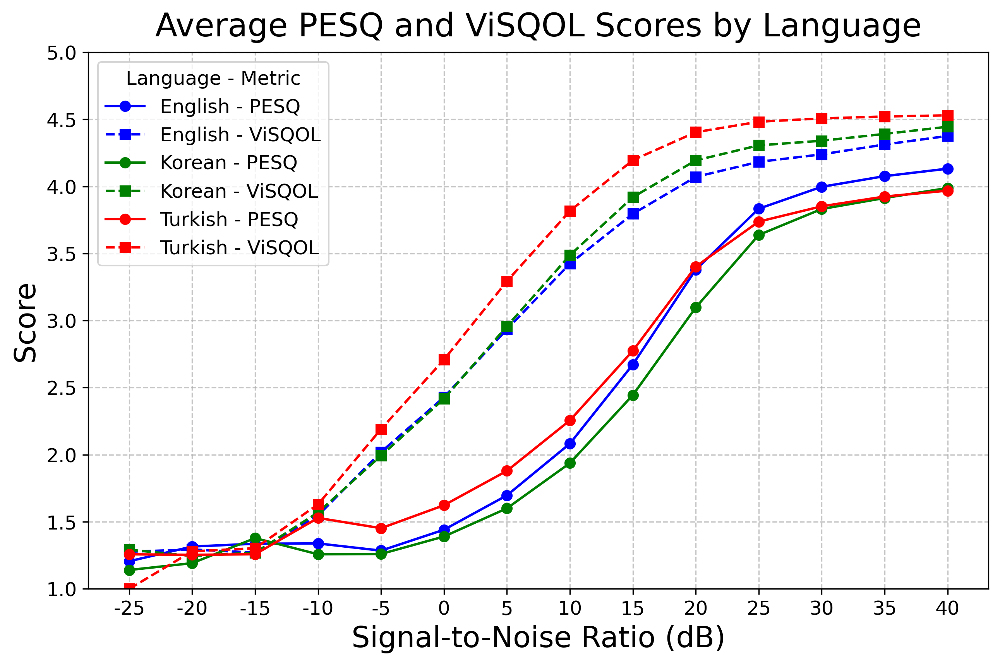
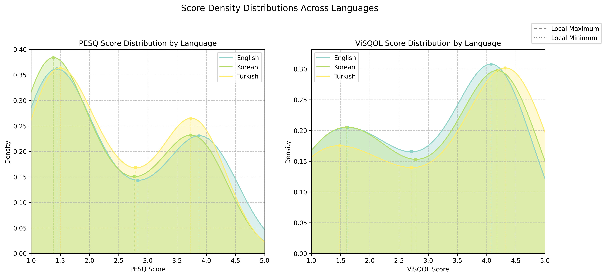

# Performance of Objective Speech Quality Metrics on Languages Beyond Validation Data

Code for Bachelor thesis, [_Performance of Objective Speech Quality Metrics on Languages Beyond Validation Data: A Study of Turkish and Korean_](TODO).

Abstract:

> This study investigates the performance of two objective speech quality metrics, Perceptual Evaluation of Speech Quality (PESQ) and Virtual Speech Quality Objective Listener (ViSQOL), in predicting human-rated speech quality scores, which are essential for telecommunication systems' Quality of Experience (QoE). These metrics have been validated using a limited number of languages due to the insufficiency of labeled data with human-rated scores. This research focuses on the applicability of PESQ and ViSQOL on Turkish and Korean, two languages that were not part of the validation data for calibrating these metrics. The experiment used English as the baseline language for comparison, and the results showed that Turkish samples had higher average ViSQOL scores, with the difference being statistically significant compared to the English samples. Furthermore, Turkish male speakers had the highest correlation between PESQ and ViSQOL scores, and ViSQOL rated speech higher than PESQ, especially under babble noise degradations. Future work should focus on exploring biases across additional metrics, languages, gender, and degradation conditions.

## Results

Below are the key visualizations from the experiment:

#### Average PESQ and ViSQOL Scores by Language
<div style="display: flex; justify-content: center; gap: 10px;">  
  
  
</div>

#### Score Density Violin Plot & Density Distributions
<div style="display: flex; justify-content: center; gap: 10px;">    
  
  
</div>

#### Scores by Degradation Type & Correlation by Gender
<div style="display: flex; justify-content: center; gap: 10px;">
  
  
</div>

These plots provide insights into the relationships between different metrics, score distributions, noise type effects, and how SNR affects PESQ and ViSQOL scores.


## Installation

To install the required packages, follow these steps:

1. Install MATLAB (**R2024a** or later) from [here](https://www.mathworks.com/downloads/).
2. Install **Python 3** from [here](https://www.python.org/downloads/).
3. Install the required **Python dependencies** by running:

   ```bash
   pip install -r requirements.txt
   
4. Install the MATLAB Engine for Python by following the instructions [here](https://www.mathworks.com/help/matlab/matlab_external/install-the-matlab-engine-for-python.html).
5. Install [Audio Toolbox](https://mathworks.com/products/audio.html) in MATLAB, as it is required for audio processing.

## Running the Experiment and Plotting Results 

To run the experiment, execute the following command:

  ```bash
  python main.py
  ```

To plot your results and perform statistical analysis, exectute the following command:

  ```bash
  python results_extractor.py
  ```

## Citation (BibTeX)

Please cite this repository if it was useful for your research:

```bibtex
@article{javipeloza2025speechqualitybias,
  title={Performance of Objective Speech Quality Metrics on Languages Beyond Validation Data: A Study of Turkish and Korean},
  subtitle={},
  author={Pérez López, Javier},
  year={2025},
  school={Delft University of Technology},
  type={Bachelor Thesis},
  url = {},
}
```
